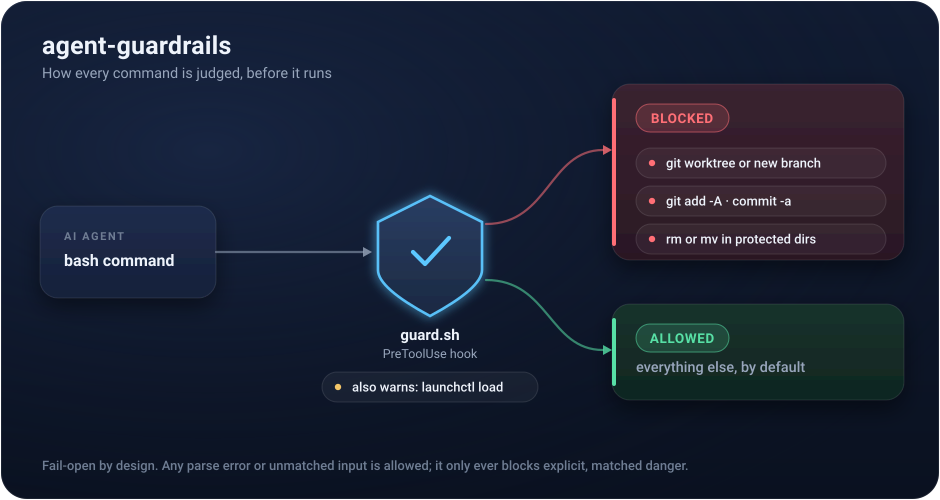

[](https://github.com/kylemillerbuilds/agent-guardrails/actions/workflows/ci.yml)
[](LICENSE)

# agent-guardrails

Safety rails for running AI coding agents on a workspace you actually care about. A PreToolUse hook for Claude Code, eight written rules, and a regression test matrix. Seven of the rules exist because skipping them cost me something real. The eighth exists because the other seven all assume the agent is merely careless.

<p align="center">
  
</p>

## The story

I run multiple AI agents against production code: a CLI agent, an IDE agent, and a paired notes vault, all sharing one working tree. One day an agent decided to use git worktrees. The IDE tried to index thousands of duplicated files and died for an entire day.

That was the first rule. The rest accumulated the same way. An agent ran `git add -A` on a tree carrying hundreds of dirty files from parallel sessions. An agent-created daemon got stuck in a restart loop, burning tokens silently. An agent confidently reported finishing work that did not exist on disk.

You can tell an agent the rules in its instructions file, and you should. But instructions are advisory and context windows are long. So the rules that matter most are also enforced in code, before the tool call runs.

## What's in the box

```
guard.sh          the PreToolUse hook (bash, no dependencies beyond python3)
test_guard.sh     regression matrix; run it green before changing the guard
rules/            the eight rules, with the why behind each one
```

The guard blocks three classes of mistake, warns on a fourth, and gates a fifth that is not a mistake at all:

1. **Git worktrees and branch creation.** Hidden work is invisible to every tool indexing the live tree.
2. **Broad git adds** (`git add -A` / `.` / `--all`, `git commit -a`). Blanket staging on a shared tree commits things nobody intended.
3. **`rm`/`mv` touching protected directories.** Configurable via `GUARD_PROTECTED_DIRS`. An agent doing "cleanup" will eventually decide something important is clutter.
4. **`launchctl load`** gets a warning, not a block. Background daemons need a human yes.
5. **Outbound `curl`/`wget` to a host that is not allowlisted.** Unlisted host asks; an upload flag
   at an unlisted host blocks; a download piped into an interpreter blocks even for an allowlisted
   host. Configure with `GUARD_EGRESS_ALLOW`.

## Design decisions that matter

**Fail-open for seven rules. Fail-closed for one.** This is the design decision I would defend
hardest, because the two halves contradict each other on purpose.

Rules 1 through 7 catch me being clumsy. Clumsiness is not adversarial: it does not adapt, it does
not try again through another door, and it is not trying to look like legitimate work. So those
rules fail open. Any parse error, missing dependency, or unmatched input allows the command. A guard
that can freeze a parallel session gets deleted within a week, and a deleted guard protects nothing.

Rule 8 catches me being lied to. Everything an agent reads through a tool is written by someone
else, and any of it can carry instructions aimed at the agent. The payoff for a landed injection is
almost always exfiltration, which needs an outbound network call, which makes outbound network the
chokepoint. Against an adversary, "allow when unsure" is the whole vulnerability. So Rule 8's
decision fails closed, and the hook flips its own `ERR` trap for the length of that block, because
the file-wide `trap allow ERR` would otherwise swallow an error inside the egress check into a
silent allow and make the claim false.

The cost is real and I am not going to hide it. Rule 8 has no heredoc stripping, so a heredoc that
merely *discusses* an upload flag next to an unlisted URL trips it. I found that out when the patch
adding Rule 8 to this repo was blocked by Rule 8 already running on my machine, because the patch
text contained an example spoofed URL beside the literal string `-d`. Fail-closed means accepting
false positives. That is exactly the trade the other seven rules refuse to make, and it is why only
one rule gets to make it.

**Fail-open, always, for the other seven.** Any parse error, missing dependency, or unmatched input allows the command. The hook is shared across concurrent sessions, so a buggy guard must never be able to freeze a parallel chat. A guard that can break your workflow gets deleted within a week. A guard that only ever blocks explicit, matched dangerous patterns gets to stay forever.

**Command-start anchoring.** The naive regex blocks `git commit -m "stop using git add -A"`, which is a commit message *about* the rule. The guard requires the dangerous invocation to actually begin a command (start of string or right after `;` `&` `|` `(`). Trade-off: an env-prefixed `FOO=bar git add .` slips through. Fail-open means accepting rare misses to guarantee zero false positives.

**Heredoc stripping.** The expensive false positive: a Python heredoc containing `var mv := Camera.new()` next to the string `"scripts/core/foo.gd"` reads to a naive scanner as `mv` touching a protected `scripts/` directory. The guard strips heredoc bodies before scanning for rm/mv, while converting newlines to `;` so a real `rm -rf scripts/x` on its own script line still blocks. That fix is most of the complexity in the file, and it's tested in both directions.

**Tests before wiring.** `test_guard.sh` feeds synthetic hook payloads to the guard and asserts
BLOCK, ASK, or ALLOW for 80+ cases, including every false positive that ever happened. Three
verdicts rather than two, because a harness that cannot tell "refused" from "asked a human" would
score Rule 8 as passing while it silently waved things through.

The matrix runs green before any guard edit ships, and green on its own is not evidence. Before
trusting the Rule 8 cases I broke the guard on purpose twice: replacing exact host matching with a
substring check (one case fails, the spoofed-host one) and disabling the pipe-to-interpreter check
(four cases fail). A test you have never watched turn red is a test you have not verified. The
single most valuable case in the file is the spoofed host whose name merely *begins* with an
allowlisted domain, because that is the bug anyone "simplifying" the matching will write.

## Example

When the guard fires, it returns a deny decision with the reason:

```
$ git add -A
{"hookSpecificOutput":{"hookEventName":"PreToolUse","permissionDecision":"deny",
"permissionDecisionReason":"Blocked by Rule 2: no broad 'git add' (-A / --all / bare '.').
Stage specific named files instead (git add path/to/file) — a shared tree often carries
dirty files from parallel sessions. See rules/02-no-broad-git-adds.md."}}
```

The agent sees the reason and stops. No prompt needed from you.

## Install

1. Drop `guard.sh` somewhere stable (e.g. `.claude/hooks/guard.sh`) and `chmod +x` it.
2. Wire it as a PreToolUse hook in `.claude/settings.json`:

```json
{
  "hooks": {
    "PreToolUse": [
      {
        "matcher": "Bash",
        "hooks": [{ "type": "command", "command": "$CLAUDE_PROJECT_DIR/.claude/hooks/guard.sh" }]
      }
    ]
  }
}
```

3. Set your protected directories if the defaults don't fit:

```bash
export GUARD_PROTECTED_DIRS="src config data docs"
```

4. Run the tests:

```bash
./test_guard.sh
```

## The rules

The hook enforces rules 1-3 and warns on 4. Rules 5-7 are honor-system, and rule 7 is the one I'd keep if I could only keep one: **verify agent claims on disk.** Agents fabricate completions. Check that the files exist, in the right place, containing what was claimed, before anyone builds on top of "done."

Full write-ups with the incident behind each rule: [rules/](rules/).

## Who made this

Kyle Miller. I build AI systems that run real businesses: e-commerce automation, internal tools, content engines. This repo is a piece of my actual operating setup, extracted and cleaned up. The business logic stays home.

**Hire me:** [themisfoundry.com](https://themisfoundry.com)

## License

MIT
